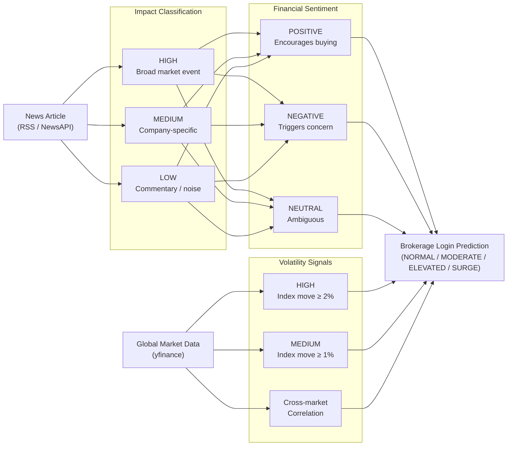
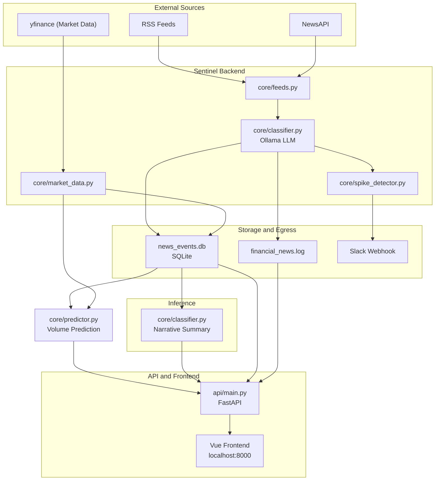

# Sentinel — Financial News Monitor

Monitors financial news feeds, classifies articles by market impact using a local Ollama LLM, and fires alerts when a burst of high-impact events is detected. Designed to give brokerage ops teams advance warning before login volume spikes hit.

A web UI displays the live event feed, classification summary, an AI-generated narrative, global market indices, sentiment charts, and a 24-hour trend chart — all auto-refreshing every 30 seconds.

## How it works


### From signals to prediction

Sentinel combines two independent data streams — financial news and global market data — into a single brokerage login volume prediction. News articles are classified by market impact (HIGH / MEDIUM / LOW) and assigned a financial sentiment (POSITIVE / NEGATIVE / NEUTRAL) by a local Ollama LLM. In parallel, global index quotes from yfinance are evaluated for volatility, detecting significant single-index moves and cross-market correlations. Both streams feed a composite scoring engine that produces the Brokerage Login Prediction visible at the top of the Dashboard.



The spike detection mirrors a login-volume spike pattern: instead of counting logins per time window, it counts HIGH-impact news events. A burst of major events is a leading indicator that user logins will spike within 10–15 minutes.


### Flow diagram



## News Article Classification levels

| Level | Examples | Expected login impact |
|-------|----------|-----------------------|
| **HIGH** | Fed rate decisions, CPI/jobs report, market moves >3%, trading halts | Likely spike within 10–15 min |
| **MEDIUM** | Earnings beats/misses, IPOs, options expiration, Fed speculation | Possible moderate increase |
| **LOW** | Analyst upgrades, minor commentary, already-priced-in news | Minimal impact |

## News Article Sentiment

Each article is assigned a sentiment label alongside its classification. Sentiment captures the emotional tone of the news relative to investor mood — independent of how market-moving the event is (a trading halt is HIGH impact but could be NEGATIVE or NEUTRAL sentiment depending on context).

| Sentiment | Meaning | Examples |
|-----------|---------|---------|
| **POSITIVE** | Good news likely to encourage buying or calm | Rate cuts, strong jobs/earnings, market rallies, deal closings |
| **NEGATIVE** | Bad news likely to trigger concern or selling | Rate hikes, recession signals, market drops, scandals, trading halts |
| **NEUTRAL** | Informational, mixed, or ambiguous investor impact | Scheduled data releases with in-line results, routine Fed commentary |

Sentiment is tracked over time and displayed as a time-series chart on the Charts page, allowing you to spot shifts in overall market tone before they surface as login volume changes.

## Global Markets

The Charts page displays live quotes for major indices across three regions, fetched every 5 minutes via yfinance (no API key required). Market data fetching is always active — it is not restricted by `MARKET_HOURS_ONLY`, since overnight moves in European and Asian markets are often the most useful early-warning signal.

| Region | Indices |
|--------|---------|
| **Europe** | FTSE 100, DAX 40, CAC 40, Euro Stoxx 50 |
| **Asia** | Nikkei 225, Hang Seng, Shanghai Composite |
| **US Futures** | S&P 500 Futures, Nasdaq Futures, Dow Futures |

Each quote shows the current price and percentage change from the previous close. Sentinel also runs volatility detection against these snapshots:

| Signal | Threshold |
|--------|-----------|
| **HIGH volatility** | ≥ 2.0% move from previous close |
| **MEDIUM volatility** | ≥ 1.0% move from previous close |

Volatility signals are logged alongside news events, giving you a second leading indicator — a sharp pre-market move in European or Asian indices often precedes a US open-bell login surge even when no news article has been classified HIGH yet.

## Volume Prediction

The Dashboard displays a **Volume Prediction** banner at the top of the page — the primary output of Sentinel. It answers the question: *"How busy is our brokerage going to be in the next 15–30 minutes?"*

### Prediction levels

| Level | Label | Expected Login Volume | Action |
|-------|-------|-----------------------|--------|
| 1 | **NORMAL** | Baseline | No action needed |
| 2 | **MODERATE** | 10–25% above baseline | Watch for escalation |
| 3 | **ELEVATED** | 25–75% above baseline | Monitor closely — consider additional resources |
| 4 | **SURGE** | 75%+ above baseline | All hands — expect significant login queue pressure |

> Volume percentages are placeholders pending calibration against Splunk login data. Update the `LEVELS` dict in `core/predictor.py` once baseline correlation data is available.

### How the score is computed

A raw score (0–100+) is calculated by summing weighted signals, then mapped to a level. All signals are derived from data already collected by Sentinel — no additional sources required.

| Signal | Condition | Points |
|--------|-----------|--------|
| Surge detector | Surge active | +40 |
| HIGH news events | Per event in spike window (max 3) | +10 each |
| MEDIUM news events | Per event in spike window (max 3) | +4 each |
| Market volatility — HIGH | Per index ≥ 2% move (max 2) | +10 each |
| Market volatility — MEDIUM | Per index ≥ 1% move (max 2) | +5 each |
| Cross-market correlation | Global rally or sell-off signal | +10 |
| Sentiment — fear | Overall sentiment score ≤ −0.5 | +8 |
| Sentiment — euphoria | Overall sentiment score ≥ +0.5 | +5 |

The banner also shows **key drivers** — the specific signals that contributed to the current score — so the prediction is always explainable, not just a number.

The score is recomputed at most once per minute and cached in SQLite between requests.

### Tuning

Weights are defined in `core/predictor.py` (`W_*` constants) and can be adjusted without touching the API or frontend. The `actual_impact` column in `news_events` is reserved for recording whether a predicted spike was confirmed — once enough events are logged, weights can be calibrated empirically.

## Situation Summary

The Dashboard displays an AI-generated 3–4 sentence narrative that synthesizes current market conditions into plain English. It is designed to answer the question a brokerage ops analyst would ask first: *"What is happening right now, and why are customers logging in?"*

**How it is derived:**

1. The last 24 hours of classified events are pulled from SQLite, ordered by impact (HIGH first, then MEDIUM), capped at 25 articles.
2. If market data is enabled, any global index with a move ≥ 0.5% from its previous close is appended as additional context.
3. Both are sent to the Ollama LLM in a single prompt, which instructs it to cover: the main financial themes driving market attention, why brokerage customers are likely logging in, and any key risk factors or catalysts to watch.
4. The result is cached in SQLite. Ollama is only called again when the cache is older than 15 minutes **or** the event count or surge state has changed since the last generation — whichever comes first.

**Surge-aware behaviour:** When a SURGE is active, the prompt instructs the LLM to focus specifically on explaining the causes of the surge rather than giving a general market overview. The summary component on the Dashboard indicates when a surge-mode narrative is being displayed.


## Prerequisites

- [Docker](https://docs.docker.com/get-docker/) and Docker Compose
- [Ollama](https://ollama.ai) running on a host reachable by the Docker containers
- A model pulled on that Ollama server — `gemma3:12b` is the default; `qwen3:8b` is a faster alternative

Check available models on your server:
```bash
curl http://your-ollama-host:11434/api/tags | python3 -m json.tool
```

## Quick start (Docker)

```bash
git clone https://github.com/kilgorjn/Sentinel.git
cd Sentinel

cp .env.example .env
# Edit .env — set OLLAMA_URL and optionally NEWSAPI_KEY

docker compose up --build -d
```

The web UI will be available at `http://localhost:8000`.

## Configuration

Copy `.env.example` to `.env` and set values. All settings can also be overridden via environment variables.

| Setting | Default | Description |
|---------|---------|-------------|
| `OLLAMA_URL` | `http://jeffs-gaming-pc.lan:11434` | Ollama server address |
| `OLLAMA_MODEL` | `gemma3:12b` | Model to use for classification and narrative |
| `NEWSAPI_KEY` | *(unset)* | Optional — 100 req/day free at newsapi.org |
| `DISPLAY_TIMEZONE` | `America/New_York` | Timezone for all frontend timestamps |
| `SPIKE_WINDOW_MINUTES` | `30` | Rolling window for burst detection |
| `SPIKE_HIGH_THRESHOLD` | `3` | HIGH events in window before SURGE fires |
| `POLL_INTERVAL_SECONDS` | `300` | How often to fetch news (5 minutes) |
| `MARKET_HOURS_ONLY` | `False` | Set `True` to restrict news polling to 09:00–17:00 ET Mon–Fri |
| `MARKET_DATA_ENABLED` | `True` | Fetch global index quotes via yfinance |
| `SLACK_WEBHOOK_URL` | *(unset)* | Set to enable Slack surge alerts |

Additional settings (RSS feeds, market tickers, confidence thresholds) live in `core/config.py`.

## Web UI

The frontend is a Vue 3 SPA with three pages, accessible via the top navigation:

### Dashboard (`/`)
- **Prediction banner** — color-coded brokerage login volume prediction (NORMAL / MODERATE / ELEVATED / SURGE) with expected volume range, recommended action, and key signal drivers; displayed at the very top of the page
- **Surge alert banner** — prominently displayed when a SURGE is active
- **Summary bar** — HIGH / MEDIUM / LOW counts for the last 24 hours; click tiles to toggle visibility
- **Narrative summary** — AI-generated 3–4 sentence analysis of current events, updated every 15 minutes; surge-aware
- **Trend chart** — 24-hour line chart showing event volume per classification with a time range selector
- **Event feed** — Full list of classified articles with source, timestamp, confidence, and reason

### Charts (`/charts`)
- **Sentiment chart** — Time-series view of POSITIVE / NEGATIVE / NEUTRAL sentiment scores
- **Global markets** — Live quotes for major indices (US, Europe, Asia) with % change, fetched via yfinance; per-symbol historical snapshots available via `/api/market/history` (not yet surfaced in the UI)

### Feeds (`/feeds`)
- Add, remove, and enable/disable RSS feeds at runtime — no restart required
- Feed list is persisted in SQLite (survives redeployment)
- One-time automatic migration from `feeds.json` to the database on first run

## Portainer / Docker stack deployment

Use `docker-compose.portainer.yml` to create a Portainer stack. Fill in `stack.env` with your values and upload it as the stack environment file.

The Docker image is published automatically to `ghcr.io/kilgorjn/sentinel:latest` on every push to `main` via GitHub Actions.

## Local development (without Docker)

```bash
python3 -m venv .venv
source .venv/bin/activate
pip install -r requirements.txt

# Smoke test — classifies 5 sample articles and exits
python -m core.monitor --test

# Production loop
python -m core.monitor
```

Frontend dev server (hot reload):
```bash
cd frontend
npm install
npm run dev       # http://localhost:5173 (proxies API calls to http://localhost:8000)
```

API server:
```bash
uvicorn api.main:app --reload --port 8000
```

## Output files

### `financial_news.log`
One JSON record per line — ship this to Splunk for correlation with your WAS access logs:

```json
{"timestamp": "2026-02-28T14:00:15+00:00", "monitored_at": "2026-02-28T14:00:22+00:00", "source": "Reuters", "title": "Federal Reserve Cuts Rates by 50 Basis Points", "classification": "HIGH", "confidence": 0.92, "reason": "Concrete Fed action affecting all market participants"}
```

**Splunk correlation query** (after shipping the log via universal forwarder, `sourcetype=financial_news`):
```spl
index=news classification=HIGH
| eval event_time=strptime(timestamp, "%Y-%m-%dT%H:%M:%S%z")
| join type=left [ search index=access_logs action=login | timechart span=1m count as logins ]
| table event_time, title, logins
| sort -event_time
```

### `news_events.db`
SQLite database for tracking classification accuracy over time and storing user-configured feeds.

```bash
# Access the DB inside the running Docker container
docker exec -it sentinel-api-1 sqlite3 /data/news_events.db

-- Today's breakdown
SELECT classification, COUNT(*) FROM news_events
WHERE published_at >= datetime('now', '-24 hours')
GROUP BY classification;

-- Record that a HIGH event actually drove a login spike
UPDATE news_events SET actual_impact = 'confirmed_spike'
WHERE title LIKE '%Federal Reserve%';

-- Measure classifier accuracy
SELECT classification, actual_impact, COUNT(*)
FROM news_events
WHERE actual_impact IS NOT NULL
GROUP BY classification, actual_impact;
```


## Tuning

**Too many false HIGH alerts?** Raise `HIGH_CONFIDENCE_MIN` in `core/config.py` (e.g. `0.75`).

**Surge fires too easily?** Increase `SPIKE_HIGH_THRESHOLD` (e.g. `5`) or extend `SPIKE_WINDOW_MINUTES`.

**Slower machine / want faster classification?** Set `OLLAMA_MODEL=qwen3:8b` in `.env`.

**Want to add a news source?** Use the Feeds page in the UI, or append an RSS URL to `RSS_FEEDS` in `core/config.py`.

## Project structure

```
Sentinel/
├── core/
│   ├── monitor.py          Main entry point and polling loop
│   ├── feeds.py            RSS + NewsAPI fetch and deduplication
│   ├── feed_handlers.py    Auto-detect RSS/Atom feed types, validate feeds
│   ├── feeds_manager.py    Manage user-configured feeds stored in SQLite
│   ├── classifier.py       Ollama HTTP client, classifier, and narrative summarizer
│   ├── spike_detector.py   Sliding-window burst detection
│   ├── market_data.py      Global index quotes via yfinance; pre-market volatility detection
│   ├── storage.py          SQLite + JSON log writer; meta key-value store
│   ├── alerts.py           Console and Slack alert dispatch
│   └── config.py           All configuration settings
├── api/
│   ├── main.py             FastAPI application and route handlers (incl. SPA catch-all)
│   ├── models.py           Pydantic response schemas
│   └── dependencies.py     Shared DB connection
├── frontend/
│   ├── src/
│   │   ├── App.vue         Root component; layout and navigation
│   │   ├── router.js       Vue Router config (Dashboard, Charts, Feeds pages)
│   │   ├── main.js         App entry point
│   │   ├── pages/
│   │   │   ├── DashboardPage.vue   News feed, summary, narrative, trend chart
│   │   │   ├── ChartsPage.vue      Sentiment chart and global markets
│   │   │   └── FeedsPage.vue       RSS feed management UI
│   │   └── components/
│   │       ├── SummaryBar.vue
│   │       ├── EventFeed.vue
│   │       ├── EventChart.vue
│   │       ├── NarrativeSummary.vue
│   │       ├── SurgeAlert.vue
│   │       ├── SentimentChart.vue
│   │       ├── GlobalMarkets.vue
│   │       ├── TimeRangeSelector.vue
│   │       └── FeedManager.vue
│   ├── public/favicon.svg
│   └── package.json
├── .github/workflows/
│   └── docker-publish.yml  Build and push to ghcr.io on push to main
├── Dockerfile              Multi-stage build (Node → Vue dist, Python app)
├── docker-compose.yml      Local development / self-hosted
├── docker-compose.portainer.yml  Portainer stack (uses published image)
├── stack.env               Environment variable template for Portainer
├── .env.example            Local .env template
└── requirements.txt        Python dependencies
```
